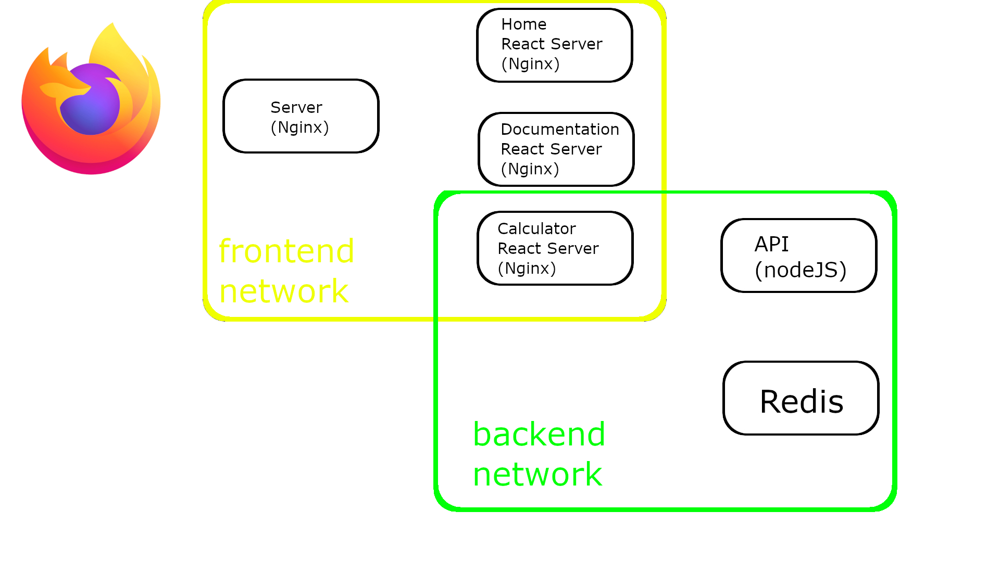

### Architektura systemu:



### Instalacja wersji developerskiej

1. Klonowanie repo
   ```sh
   git clone https://github.com/sz3jdii/PFSwChO_Z_1.git
   ```
2. Skopiowanie pliku .env.example do .env
   ```sh
   cp .env.example .env
   nano .env
   ```
3. Uruchomienie docker-compose
   ```sh
   docker-compose -f docker-compose.dev.yml up --build --force-recreate
   ```
4. Sprawdzenie w przeglądarce strony
   ```sh
   http://localhost
   ```
   
   ### Instalacja wersji produkcyjnej
   Instalacja odbywa się z wykorzystaniem TravisCI.
